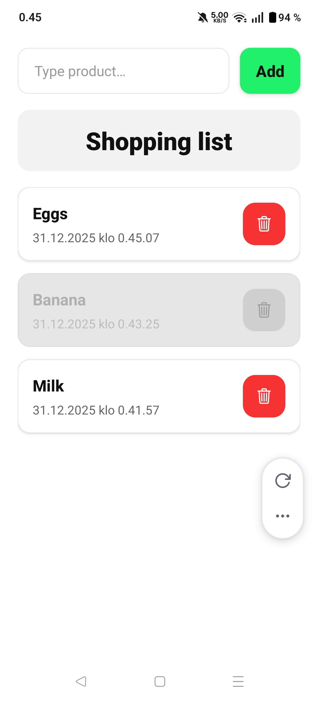

# Web- and Hybrid Technologies in Mobile Programming

**Exercise. Firebase application**
> Create a mobile app making use of Firebase. Application could be, for example, a
shopping list application, where users can have a shopping list where items can be
added, deleted or marked to be purchased. Topic is free, but application must have
following features:
- Retrieving data
- Adding data
- Deleting data

## App image

